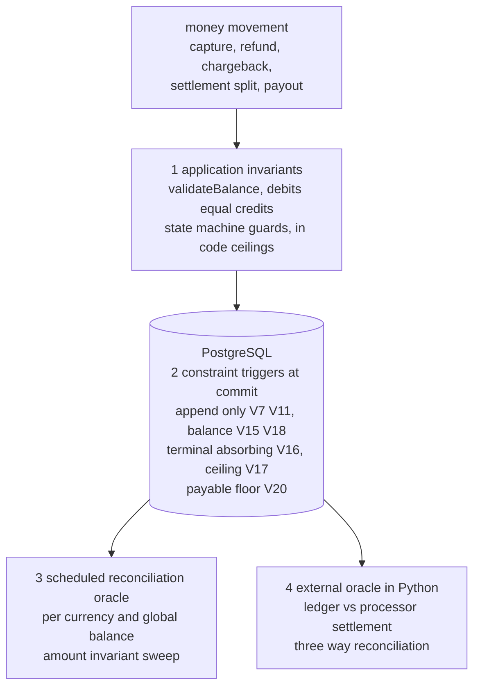

# payment-service


A payment processing service built around a double-entry ledger as the source of truth, with a 3-layer safety model inspired by [Stripe's money movement validation architecture](https://stripe.com/blog/payment-api-design).

Kotlin, Spring Boot 3, PostgreSQL. Every design decision is spelled out with its tradeoff: the repository shows how I reason about correctness under concurrency and failure in money movement.

## ledger integrity: defense in depth

Correctness of the money is enforced at four independent layers, so a fault that slips one layer is still caught by the next. This is the core idea of the project.



Layer 1 rejects a bad write before it is sent. Layer 2 makes a bad write impossible to commit, enforced in the database below the application. Layer 3 sweeps the committed ledger on a schedule for any anomaly the first two missed. Layer 4 compares the ledger against the processor settlement file, the one input that is genuinely independent of this codebase.

## architecture

```
        X-Api-Key auth filter (hashed keys, ownership checks)
                                       │
┌──────────────────────────────────────▼───────────────────────────────┐
│  API layer                                                           │
│  POST /payments /capture /refund GET / GET /merchants/ {id} /balance │
└──────────────────────────────────────┬───────────────────────────────┘
                                       │
┌──────────────────────────────────────▼───────────────────────────────┐
│  Layer 1: GATE                                                       │
│  - idempotency (DB unique constraint + sha-256 request hash)         │
│  - request validation (Bean Validation)                              │
│  - merchant verification (active status check)                       │
└──────────────────────────────────────┬───────────────────────────────┘
                                       │
┌──────────────────────────────────────▼───────────────────────────────┐
│  Layer 2: CORE                                                       │
│  - state machine (enum with transition rules)                        │
│  - double-entry ledger (immutable, append-only, DB-enforced)         │
│  - atomic writes (@Transactional: status + ledger)                   │
│  - optimistic concurrency (@Version) against double-capture          │
└──────────────────────────────────────┬───────────────────────────────┘
                                       │
┌──────────────────────────────────────▼───────────────────────────────┐
│  Layer 3: GUARD (scheduled)                                          │
│  - stuck / missing-ledger / imbalanced detection                     │
│  - per-currency + global ledger balance verification                 │
│  - log-based alert marker + prometheus gauge/counter                 │
└──────────────────────────────────────────────────────────────────────┘

  async spine: transactional outbox → @Scheduled dispatcher (SKIP LOCKED,
  exponential backoff, dead-letter) → provider simulator → signed webhook
  callback. settlement batch drives CAPTURED → SETTLED on a T+N delay.
```

Provider dispatch is never fired inline. `createPayment` commits the transaction **and** the outbox event in one transaction; a separate dispatcher delivers it. A crash between commit and provider call can't lose the call — the outbox redelivers and the webhook handler is idempotent.

## payment state machine

```
CREATED ──→ PENDING ──→ AUTHORIZED ──→ CAPTURED ──→ SETTLED
   │           │            │              │
   └→ FAILED   └→ FAILED    └→ FAILED      └→ REFUNDED
```

Every transition is enforced by `PaymentStatus.transitionTo()`. Invalid transitions throw `InvalidStateTransitionException` (HTTP 409). Terminal states (`SETTLED`, `FAILED`, `REFUNDED`) have no outgoing edges. Each transition is recorded as an immutable row in `transaction_events` (append-only audit history).

## double-entry ledger

Every money movement creates balanced entries. Debits always equal credits.

**Capture** (10000 minor units, 2% fee):
| entry | account | type | amount |
|-------|---------|------|--------|
| 1 | INCOMING | DEBIT | 10000 |
| 2 | MERCHANT | CREDIT | 9800 |
| 3 | PLATFORM | CREDIT | 200 |

**Refund** reverses with opposite entries. `LedgerService.validateBalance()` asserts `sum(debits) == sum(credits)` before persisting — if the math is wrong, the transaction rolls back.

Entries are grouped by `posting_group_id`, the atomic unit the deferred balance trigger checks at commit. Payment postings use the transaction id as their group; treasury postings (payouts, reserve releases) have **no** transaction — their group is the payout or hold id.

## payouts and rolling reserve

Settlement is not just a status milestone: it splits the merchant's captured net across three per-merchant pots, completing the money lifecycle capture → settle → reserve → payout.

| account | meaning |
|---------|---------|
| `MERCHANT` | pending — captured, not yet settled |
| `MERCHANT_PAYABLE` | available — settled, disbursable |
| `MERCHANT_RESERVE` | rolling reserve withheld against chargeback exposure |
| `PAYOUT_CLEARING` | disbursed — in transit to the merchant's bank |

**Settlement split** (at `CAPTURED → SETTLED`, atomic with the status change; default 1000 bps reserve held 90 days — industry standard is 5–10% for 90–180 days):
| entry | account | type | amount |
|-------|---------|------|--------|
| 1 | MERCHANT | DEBIT | 9800 |
| 2 | MERCHANT_RESERVE | CREDIT | 980 |
| 3 | MERCHANT_PAYABLE | CREDIT | 8820 |

A scheduled batch releases matured holds back to payable. Payouts (scheduled auto-payout above a minimum, or manual via the API) move payable into `PAYOUT_CLEARING`; a `PENDING` payout is confirmed `PAID` after T+N (no ledger movement) or `FAILED` with compensating reversal entries.

Two rules make the flow honest under failure:

- **a chargeback lost after settlement debits `MERCHANT_PAYABLE`, which may go negative** — the merchant owes the platform, and the reserve exists to cover exactly that hole
- **a payout may never drive payable below zero.** The application guard serializes payouts per merchant with `SELECT ... FOR UPDATE` on the merchants row (the balance is a `SUM`, so optimistic locking has no row to version), and the V20 deferred constraint trigger re-proves the floor at commit against any writer that bypasses the service — chargeback postings are exempted by the absence of a `PAYOUT_CLEARING` leg in their posting group

Known limitation, deliberate: `PARTIALLY_REFUNDED` has no `SETTLED` edge in the state machine, so "partial refund then settle" is unreachable and the split does not model it.

Amounts are stored as `BIGINT` minor units (never floats). Fees are basis points (`200 bps = 2.00%`), and `platformFee()` **floors** via `Math.floorDiv` — the fractional remainder stays with the merchant so the platform never over-collects and the entry set still balances exactly. Balances are computed **per currency**; the global guard checks debits == credits within each currency, never as one cross-currency sum.

## key design decisions

| decision | why |
|----------|-----|
| BIGINT minor units, not DECIMAL | IEEE 754: `0.1 + 0.2 ≠ 0.3`. Stripe, Adyen, Square all use integer minor units |
| basis points, floored fee | integer arithmetic only; merchant absorbs the rounding remainder so the ledger balances exactly |
| `@Transactional` on capture/refund | status change + ledger entries are atomic — both commit or both roll back |
| `@Version` optimistic lock | concurrent capture of the same authorization → 409, not a double spend |
| idempotency via DB constraint + request hash | `UNIQUE (merchant_id, idempotency_key)`; sha-256 of the payload → 422 on key reuse with a different body |
| transactional outbox | provider dispatch intent commits with the transaction; `SKIP LOCKED` claim makes it multi-instance safe; exponential backoff + dead-letter |
| signed webhooks | constant-time HMAC-SHA256 over the **raw body** verified before deserialize; `t=...,v1=...` timestamp inside a tolerance window defeats replay |
| API keys hashed at rest | sha-256 (high-entropy keys need no slow KDF) → O(1) indexed lookup; bcrypt's per-row salt would force a full scan |
| ledger + events immutable in the DB | `BEFORE UPDATE/DELETE` triggers reject mutation — the audit trail is enforced below the application, not just in code |
| `hibernate.ddl-auto: validate` | Flyway owns the schema; Hibernate only validates — no surprise DDL |
| Testcontainers, not H2 | H2 differs from PostgreSQL on JSONB, triggers, partial indexes, constraints |
| state machine in enum | compile-time exhaustive checks; you can't add a state without defining its transitions |
| Spring Modulith boundaries | `ApplicationModules.verify()` fails the build on a module cycle or cross-module access of internal types |

## answering the obvious objections

**Why Camunda for a single deadline.** The dispute evidence deadline is a durable timer measured in days that must survive restarts, carry an auditable history, and drive a state transition when it fires. A scheduled sweep over a deadline column does the same job with far less weight, and for one timer that would be the proportionate choice. Camunda earns its place only once the dispute workflow grows into the multi step process it models in real acquiring: evidence submission, representment, arbitration, each with its own timer and compensation. This repo ships the first slice of that process and uses the engine to keep the timeline explicit and durable rather than implicit in a cron column. If the workflow never grows, swap it for a scheduled sweep. The tradeoff is stated, not hidden.

**Why hand rolled API key auth instead of Spring Security.** Authentication here is one lookup of a hashed, indexed key plus an ownership predicate on every read and write. A thin `OncePerRequestFilter` expresses exactly that, in code a reader can audit in a minute, where Spring Security would add a large configuration surface for a model that needs none of its filter chain. Keys are SHA 256 hashed at rest and resolved by an indexed unique lookup, never compared in plaintext. The cost is that rate limiting, key rotation, and scopes are not free the way they would be under a framework, and those are listed in the production gaps rather than pretended away.

**Why a Python package inside a Kotlin service.** A reconciliation oracle must be independent of the code that writes the ledger, or a bug in the writer can hide inside the checker. Knight and Leveson showed in 1986 that independently written implementations of the same specification still fail in correlated ways, so a self check mostly catches transcription faults that a unit test already covers. The one genuinely independent input is the settlement file from the processor, so the oracle that compares the ledger against it lives as a separate zero dependency Python package with its own property tests and a one hundred percent mutation kill. A different language keeps it physically and operationally separate from the service it audits. The cost is a second toolchain in the repo, which is the price of that independence.

## modules

One module per direct sub-package, verified acyclic at build time (`ModularityTest`). The dependency graph is a DAG:

```
shared, ledger ──◄── merchant ──◄── payment ──◄── auth, config,
                        ▲         (outbox)         reconciliation, settlement
                        │                                        │
                        └────────── payout ◄─────────────────────┘
```

`shared` is the kernel (error body, the merchant-id request-attribute key, the access-denied exception). The transactional outbox lives **inside** the payment module (`payment.outbox`) because it is payment's own infrastructure.

## api

All `/api/v1/payments/**` and `/api/v1/merchants/**` requests require an `X-Api-Key` header; the authenticated merchant — never the request body — owns the transaction. Cross-merchant reads return 404 (no id enumeration).

| method | endpoint | description |
|--------|----------|-------------|
| POST | `/api/v1/payments` | create payment (`X-Api-Key`, `Idempotency-Key` headers) |
| GET | `/api/v1/payments/{id}` | get payment status (owner only) |
| POST | `/api/v1/payments/{id}/capture` | capture authorized payment (atomic: status + ledger) |
| POST | `/api/v1/payments/{id}/refund` | refund captured payment (atomic: status + ledger) |
| POST | `/api/v1/webhooks/provider-callback` | provider authorization callback (`X-Webhook-Signature` HMAC) |
| GET | `/api/v1/merchants/{id}/balance` | per-currency pending / available / reserve, computed from the ledger |
| POST | `/api/v1/merchants/{id}/payouts` | disburse the payable balance (amount optional = full available) |
| GET | `/api/v1/merchants/{id}/payouts` | list payouts (owner only) |
| GET | `/api/v1/reconciliation` | full reconciliation report (layer 3 guard) |
| GET | `/actuator/health` `/actuator/prometheus` | health + metrics |
| GET | `/api/v1/api-docs` `/swagger-ui.html` | OpenAPI 3.0 + Swagger UI |

## observability

- micrometer + `/actuator/prometheus`; domain counters `payments.captured`/`refunded`/`settled{currency}`, `payments.callbacks{outcome}`, `reconciliation.healthy` gauge + `anomalies` counter
- MDC correlation: a request-id filter sets/echoes `X-Request-Id`; capture/refund/callback bind `txnId` — log pattern surfaces both
- reconciliation runs on a schedule and emits a single `RECONCILIATION_ALERT` error line per anomaly category — a zero-infra alerting seam

## tech stack

| component | version | why |
|-----------|---------|-----|
| Kotlin | 1.9.25 | Spring Boot 3.5 managed version, null safety, concise JPA entities |
| Spring Boot | 3.5.0 | latest stable, native Testcontainers support |
| Spring Modulith | 1.4.1 | build-time module boundary verification |
| Micrometer + Prometheus | managed | metrics + scrape endpoint |
| PostgreSQL | 17 | JSONB, triggers, partial indexes, CHECK constraints |
| Flyway | managed | versioned schema migrations, repeatable builds |
| Testcontainers | 1.21.4 | real PostgreSQL in tests, not H2 |
| SpringDoc OpenAPI | 2.8.6 | auto-generated API docs from controllers |

## project structure

```
src/main/kotlin/com/paymentservice/
├── auth/             # ApiKeyAuthFilter (X-Api-Key), ApiKeyHasher (sha-256 at rest)
├── config/           # GlobalExceptionHandler, RequestIdFilter (MDC correlation)
├── shared/           # kernel: ErrorResponse, MERCHANT_ID_ATTRIBUTE, PaymentAccessDeniedException
├── ledger/           # LedgerEntry (immutable), LedgerService (fees, balances), LedgerRepository
├── merchant/         # Merchant, MerchantController (balance), Merchant exceptions
├── payment/
│   ├── dto/          # CreatePaymentRequest, PaymentResponse
│   ├── outbox/       # OutboxEvent + dispatcher/processor (SKIP LOCKED, backoff, dead-letter)
│   ├── PaymentController.kt / PaymentService.kt / PaymentCreator.kt
│   ├── PaymentStatus.kt          # state machine enum
│   ├── Transaction.kt            # @Version, JSONB payment method
│   ├── TransactionEvent.kt       # append-only transition history
│   ├── PaymentProviderSimulator.kt
│   ├── WebhookController.kt / WebhookSigner.kt   # HMAC, replay window
├── payout/           # Payout + ReserveHold entities, PayoutService (row-lock guard),
│                     # ReserveService, @Scheduled payout/confirm/release batches
├── reconciliation/   # ReconciliationService + @Scheduled ReconciliationScheduler
└── settlement/       # SettlementBatch (@Scheduled) + SettlementProcessor (CAPTURED → SETTLED
                      # + settlement split), ledger → recon CSV extract
```

## testing

30 test classes, 190 tests, all green. Integration tests run against real PostgreSQL via Testcontainers.

- **unit**: state machine transitions/terminals (`PaymentStatusTest`), fee rounding direction (`LedgerFeeTest`), money model and ISO 4217 exponents (`MoneyTest`), settlement movement projection (`SettlementExtractorTest`), HMAC signing + replay window (`WebhookSignerTest`), dispute state machine (`DisputeStatusTest`), module boundaries (`ModularityTest`)
- **integration**: full lifecycle + ledger/balance math, idempotency + concurrent double-capture (409), partial and multi capture with partial refund, authorization void and expiry, disputes and chargebacks with ledger clawback (pre- and post-settlement), outbox concurrency (one winner via `SKIP LOCKED`) + backoff/dead-letter, signed-webhook acceptance/rejection, settlement split + reserve hold/release, payout lifecycle + concurrent double-payout race (row lock, one winner), ledger export to the recon movement CSV, append-only history immutability, the deferred balance/terminal/ceiling/payable-floor constraint triggers, provider retry and circuit breaker, auth + ownership (401/403/404), reconciliation, prometheus counters
- **mutation**: pitest over the money and security core (`./gradlew pitest`), and the Python recon core via `mutmut` with a zero survivor gate in CI

```bash
./gradlew test
```

> The async provider callback in tests targets a parked `localhost:1`, so a `ConnectException` in the log is expected noise — `BUILD SUCCESSFUL` is the signal.

## running locally

```bash
# full stack: builds the image, starts postgresql and the service together
docker compose up --build

# or, for development, start only postgresql and run the app from gradle
docker compose up -d db
./gradlew bootRun
```

## quick test

Seeded merchant `a0eebc99-9c0b-4ef8-bb6d-6bb9bd380a11` with API key `test-api-key-123` (hashed at rest).

```bash
KEY="test-api-key-123"
MID="a0eebc99-9c0b-4ef8-bb6d-6bb9bd380a11"

# create payment — the outbox dispatcher then calls the provider, which posts
# a signed authorization callback back to the service automatically
curl -s -X POST http://localhost:8080/api/v1/payments \
  -H "Content-Type: application/json" \
  -H "X-Api-Key: $KEY" \
  -H "Idempotency-Key: test-001" \
  -d "{\"merchantId\":\"$MID\",\"amount\":10000,\"currency\":\"EUR\"}" | jq .

# once AUTHORIZED, capture (atomic: status + ledger)
curl -s -X POST http://localhost:8080/api/v1/payments/<ID>/capture -H "X-Api-Key: $KEY" | jq .

# per-currency balance (10000 - 2% fee = 9800)
curl -s http://localhost:8080/api/v1/merchants/$MID/balance -H "X-Api-Key: $KEY" | jq .

# reconciliation (layer 3 guard) + metrics
curl -s http://localhost:8080/api/v1/reconciliation -H "X-Api-Key: $KEY" | jq .
curl -s http://localhost:8080/actuator/prometheus | grep payments_
```

The `/webhooks/provider-callback` endpoint requires a valid `X-Webhook-Signature` (HMAC over the raw body within a tolerance window), so it is normally driven by the provider simulator rather than called by hand.

## database schema

20 Flyway migrations (`hibernate.ddl-auto: validate`, Flyway owns the schema):

| migration | change |
|-----------|--------|
| `V1` | `merchants` + seeded test merchant |
| `V2` | `transactions`, `UNIQUE(merchant_id, idempotency_key)`, BIGINT amounts, JSONB payment method |
| `V3` | `ledger_entries`, immutable, CHECK constraints on amounts |
| `V4` | `version` column for optimistic locking |
| `V5` | sha-256 `request_hash` for idempotency payload checks |
| `V6` | `outbox_events` |
| `V7` | hardening: append-only trigger on ledger, `TIMESTAMPTZ`, status CHECK, partial active index |
| `V8` | outbox `next_attempt_at` + dispatchable partial index (exponential backoff) |
| `V9` | hash API keys at rest (pgcrypto), drop plaintext column |
| `V10` | partial index for settlement-eligible (`CAPTURED`) rows |
| `V11` | `transaction_events` append-only history + immutability trigger |
| `V12` | `payment_operations` for partial/multi capture and partial refund, `UNIQUE(transaction_id, idempotency_key)` |
| `V13` | authorization void/expiry support |
| `V14` | `disputes` for chargeback lifecycle with ledger clawback |
| `V15` | deferred constraint trigger: per-currency ledger balance at commit |
| `V16` | deferred constraint trigger: terminal status is absorbing |
| `V17` | deferred constraint trigger: captured never exceeds authorized, refunded never exceeds captured |
| `V18` | posting groups: `posting_group_id` decouples ledger entries from payment transactions; balance trigger regroups on it |
| `V19` | `payouts` + `reserve_holds` for the settlement split and disbursement lifecycle |
| `V20` | deferred constraint trigger: a payout never drives the payable balance negative |

## production gaps / next steps

This demonstrates the correctness and operability primitives. Real card processing at a PSP would additionally require:

- **real acquirer/network integration**: the provider is a simulator. Settlement is a state milestone only, with no clearing entries and no acquirer settlement-file ingestion
- **PCI scope**: card tokenization/vaulting and **SCA/3DS** (PSD2) are absent
- **payout rails**: disbursement stops at `PAYOUT_CLEARING` — no bank file/SEPA integration, payout confirmation is a T+N milestone rather than a bank acknowledgment
- **scale/ops**: time-partitioning and archival for the append-only tables, distributed tracing, leader election for scheduled jobs, rate limiting, API-key rotation/scopes
