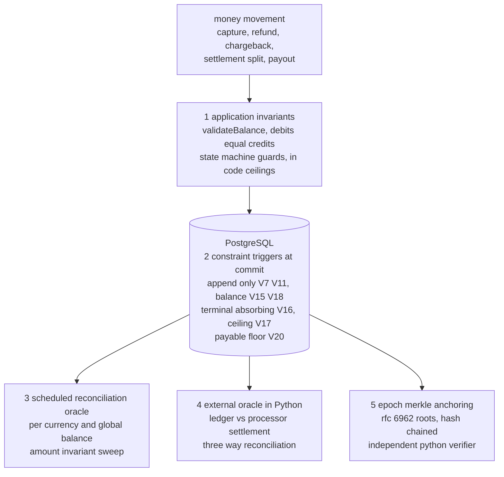
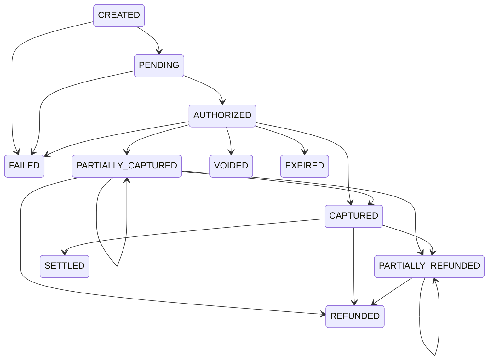

# payment-service


A payment processing service built around a double-entry ledger as the source of truth, with a 3-layer safety model inspired by [Stripe's money movement validation architecture](https://stripe.com/blog/payment-api-design).

Kotlin, Spring Boot 3, PostgreSQL. Every design decision is spelled out with its tradeoff: the repository shows how I reason about correctness under concurrency and failure in money movement.

Short on time? [`docs/walkthrough.md`](docs/walkthrough.md) is a 10-minute guided tour that runs every claim live: capture → ledger, the DB-level guards, the tamper drill, the recon oracles, the chaos verdict, the measured perf numbers and the executed restore drill.

## ledger integrity: defense in depth

Correctness of the money is enforced at five independent layers, so a fault that slips one layer is still caught by the next. This is the core idea of the project.



Layer 1 rejects a bad write before it is sent. Layer 2 makes a bad write impossible to commit, enforced in the database below the application. Layer 3 sweeps the committed ledger on a schedule for any anomaly the first two missed. Layer 4 compares the ledger against the processor settlement file, the one input that is genuinely independent of this codebase. Layer 5 makes the committed history itself tamper-evident: entries are sealed under chained Merkle roots, so even a superuser edit below every other layer is exposed by recomputation. The balance snapshots that accelerate reads (V23) sit deliberately outside this chain: a derived, rebuildable cache over the immutable log, whose drift against the raw ledger SUM is itself one of layer 3's scheduled checks.

## architecture

```
        X-Api-Key auth filter (hashed keys, ownership checks)
                                       │
┌──────────────────────────────────────▼───────────────────────────────┐
│  API layer                                                           │
│  POST /payments /capture /refund GET / GET /merchants/ {id} /balance │
└──────────────────────────────────────┬───────────────────────────────┘
                                       │
┌──────────────────────────────────────▼───────────────────────────────┐
│  Layer 1: GATE                                                       │
│  - idempotency (DB unique constraint + sha-256 request hash)         │
│  - request validation (Bean Validation)                              │
│  - merchant verification (active status check)                       │
└──────────────────────────────────────┬───────────────────────────────┘
                                       │
┌──────────────────────────────────────▼───────────────────────────────┐
│  Layer 2: CORE                                                       │
│  - state machine (enum with transition rules)                        │
│  - double-entry ledger (immutable, append-only, DB-enforced)         │
│  - atomic writes (@Transactional: status + ledger)                   │
│  - optimistic concurrency (@Version) against double-capture          │
└──────────────────────────────────────┬───────────────────────────────┘
                                       │
┌──────────────────────────────────────▼───────────────────────────────┐
│  Layer 3: GUARD (scheduled)                                          │
│  - stuck / missing-ledger / imbalanced detection                     │
│  - per-currency + global ledger balance verification                 │
│  - log-based alert marker + prometheus gauge/counter                 │
└──────────────────────────────────────────────────────────────────────┘

  async spine: transactional outbox → @Scheduled dispatcher (SKIP LOCKED,
  exponential backoff, dead-letter) → provider simulator → signed webhook
  callback. settlement batch drives CAPTURED → SETTLED on a T+N delay.
```

Provider dispatch is never fired inline. `createPayment` commits the transaction **and** the outbox event in one transaction; a separate dispatcher delivers it. A crash between commit and provider call can't lose the call — the outbox redelivers and the webhook handler is idempotent.

All nine scheduled batches (outbox dispatch, settlement, expiry, the payout and reserve cycles, reconciliation, anchor sealing, snapshot folds) take a ShedLock lease in the same database (V24), so running more than one replica never double-fires a batch: `SKIP LOCKED` makes the workers contention-safe row by row, the lease makes each batch single-flight cluster-wide. A graceful shutdown releases the lease; a SIGKILLed pod's lease is reclaimed when `lockAtMostFor` expires.

## payment state machine



Eleven statuses; every transition is enforced by `PaymentStatus.transitionTo()`, and an invalid one is HTTP 409. Partial capture and refund **self-loop**: each successive partial operation re-enters the same state until the running total reaches the boundary (`captured == amount` → `CAPTURED`, `refunded == captured` → `REFUNDED`) — the money invariants themselves are enforced from ledger sums, not from the coarse label. Capture and refund are sequential phases: once a refund starts, there is no further capture edge. `VOIDED` (merchant cancellation) and `EXPIRED` (the auth hold lapsing on a schedule) release a **clean** authorization only; once anything is captured, the path forward is refund. Terminal states (`SETTLED`, `FAILED`, `REFUNDED`, `VOIDED`, `EXPIRED`) have no outgoing edges, and the V16 trigger makes them absorbing below the application too. Each transition is recorded as an immutable row in `transaction_events` (append-only audit history).

## double-entry ledger

Every money movement creates balanced entries. Debits always equal credits.

**Capture** (10000 minor units, 2% fee):
| entry | account | type | amount |
|-------|---------|------|--------|
| 1 | INCOMING | DEBIT | 10000 |
| 2 | MERCHANT | CREDIT | 9800 |
| 3 | PLATFORM | CREDIT | 200 |

**Refund** reverses with opposite entries. `LedgerService.validateBalance()` asserts `sum(debits) == sum(credits)` before persisting — if the math is wrong, the transaction rolls back.

Entries are grouped by `posting_group_id`, the atomic unit the deferred balance trigger checks at commit. Payment postings use the transaction id as their group; treasury postings (payouts, reserve releases) have **no** transaction — their group is the payout or hold id.

A balance is always a ledger derivation, never a stored counter — but reads no longer pay a full-history scan. A rolling snapshot (V23) checkpoints debit/credit totals per (account, currency) behind a single fold cursor, and a live read is snapshot plus the entries created after the cursor, so read cost is bounded by the fold cadence rather than ledger size. The snapshot is a derived cache, not a source of truth: it carries no append-only trigger, is rebuildable from the log at any time, and scheduled reconciliation re-derives exact balances from `ledger_entries` and flags any drift.

This claim is measured, not asserted: on a 5M-row ledger the full-history SUM costs ~225 ms and grows linearly, the snapshot read stays flat at ~0.5 ms, and the balance endpoint that collapsed at 10 req/s before the wiring holds 100 req/s at p99 5.6 ms after it. Harness, method and honesty notes: [`perf/`](perf/README.md).

## payouts and rolling reserve

Settlement is not just a status milestone: it splits the merchant's captured net across three per-merchant pots, completing the money lifecycle capture → settle → reserve → payout.

| account | meaning |
|---------|---------|
| `MERCHANT` | pending — captured, not yet settled |
| `MERCHANT_PAYABLE` | available — settled, disbursable |
| `MERCHANT_RESERVE` | rolling reserve withheld against chargeback exposure |
| `PAYOUT_CLEARING` | disbursed — in transit to the merchant's bank |

**Settlement split** (at `CAPTURED → SETTLED`, atomic with the status change; default 1000 bps reserve held 90 days — industry standard is 5–10% for 90–180 days):
| entry | account | type | amount |
|-------|---------|------|--------|
| 1 | MERCHANT | DEBIT | 9800 |
| 2 | MERCHANT_RESERVE | CREDIT | 980 |
| 3 | MERCHANT_PAYABLE | CREDIT | 8820 |

A scheduled batch releases matured holds back to payable. Payouts (scheduled auto-payout above a minimum, or manual via the API) move payable into `PAYOUT_CLEARING`; a `PENDING` payout is confirmed `PAID` after T+N (no ledger movement) or `FAILED` with compensating reversal entries.

Two rules make the flow honest under failure:

- **a chargeback lost after settlement debits `MERCHANT_PAYABLE`, which may go negative** — the merchant owes the platform, and the reserve exists to cover exactly that hole
- **a payout may never drive payable below zero.** The application guard serializes payouts per merchant with `SELECT ... FOR UPDATE` on the merchants row (the balance is a `SUM`, so optimistic locking has no row to version), and the V20 deferred constraint trigger re-proves the floor at commit against any writer that bypasses the service — chargeback postings are exempted by the absence of a `PAYOUT_CLEARING` leg in their posting group

Known limitation, deliberate: `PARTIALLY_REFUNDED` has no `SETTLED` edge in the state machine, so "partial refund then settle" is unreachable and the split does not model it.

Amounts are stored as `BIGINT` minor units (never floats). Fees are basis points (`200 bps = 2.00%`), and `platformFee()` **floors** via `Math.floorDiv` — the fractional remainder stays with the merchant so the platform never over-collects and the entry set still balances exactly. Balances are computed **per currency**; the global guard checks debits == credits within each currency, never as one cross-currency sum.

## key design decisions

| decision | why |
|----------|-----|
| BIGINT minor units, not DECIMAL | IEEE 754: `0.1 + 0.2 ≠ 0.3`. Stripe, Adyen, Square all use integer minor units |
| basis points, floored fee | integer arithmetic only; merchant absorbs the rounding remainder so the ledger balances exactly |
| `@Transactional` on capture/refund | status change + ledger entries are atomic — both commit or both roll back |
| `@Version` optimistic lock | concurrent capture of the same authorization → 409, not a double spend |
| idempotency via DB constraint + request hash | `UNIQUE (merchant_id, idempotency_key)`; sha-256 of the payload → 422 on key reuse with a different body |
| transactional outbox | provider dispatch intent commits with the transaction; `SKIP LOCKED` claim makes it multi-instance safe; exponential backoff + dead-letter |
| signed webhooks | constant-time HMAC-SHA256 over the **raw body** verified before deserialize; `t=...,v1=...` timestamp inside a tolerance window defeats replay |
| API keys hashed at rest | sha-256 (high-entropy keys need no slow KDF) → O(1) indexed lookup; bcrypt's per-row salt would force a full scan |
| ledger + events immutable in the DB | `BEFORE UPDATE/DELETE` triggers reject mutation — the audit trail is enforced below the application, not just in code |
| `hibernate.ddl-auto: validate` | Flyway owns the schema; Hibernate only validates — no surprise DDL |
| Testcontainers, not H2 | H2 differs from PostgreSQL on JSONB, triggers, partial indexes, constraints |
| state machine in enum | compile-time exhaustive checks; you can't add a state without defining its transitions |
| Spring Modulith boundaries | `ApplicationModules.verify()` fails the build on a module cycle or cross-module access of internal types |
| ShedLock lease on every scheduled job | two replicas would double-fire every batch; a lease in the same PG (V24) makes each of the nine jobs single-flight cluster-wide, with `lockAtMostFor` as the crash reclaim |
| balance snapshots as a derived cache | reads are checkpoint + tail, not a full-history SUM; no trigger protects the snapshot because it is rebuildable — reconciliation audits its drift against the raw ledger |

## answering the obvious objections

**Why Camunda for a single deadline.** The dispute evidence deadline is a durable timer measured in days that must survive restarts, carry an auditable history, and drive a state transition when it fires. A scheduled sweep over a deadline column does the same job with far less weight, and for one timer that would be the proportionate choice. Camunda earns its place only once the dispute workflow grows into the multi step process it models in real acquiring: evidence submission, representment, arbitration, each with its own timer and compensation. This repo ships the first slice of that process and uses the engine to keep the timeline explicit and durable rather than implicit in a cron column. If the workflow never grows, swap it for a scheduled sweep. The tradeoff is stated, not hidden.

**Why hand rolled API key auth instead of Spring Security.** Authentication here is one lookup of a hashed, indexed key plus an ownership predicate on every read and write. A thin `OncePerRequestFilter` expresses exactly that, in code a reader can audit in a minute, where Spring Security would add a large configuration surface for a model that needs none of its filter chain. Keys are SHA 256 hashed at rest and resolved by an indexed unique lookup, never compared in plaintext. The cost is that rate limiting, key rotation, and scopes are not free the way they would be under a framework, and those are listed in the production gaps rather than pretended away.

**Why a Python package inside a Kotlin service.** A reconciliation oracle must be independent of the code that writes the ledger, or a bug in the writer can hide inside the checker. Knight and Leveson showed in 1986 that independently written implementations of the same specification still fail in correlated ways, so a self check mostly catches transcription faults that a unit test already covers. The one genuinely independent input is the settlement file from the processor, so the oracle that compares the ledger against it lives as a separate zero dependency Python package with its own property tests and a one hundred percent mutation kill. A different language keeps it physically and operationally separate from the service it audits. The cost is a second toolchain in the repo, which is the price of that independence.

## modules

One module per direct sub-package, verified acyclic at build time (`ModularityTest`). The dependency graph is a DAG:

```
shared, ledger ──◄── merchant ──◄── payment ──◄── auth, config,
                        ▲         (outbox)         reconciliation, settlement
                        │                                        │
                        └────────── payout ◄─────────────────────┘
```

`shared` is the kernel (error body, the merchant-id request-attribute key, the access-denied exception). The transactional outbox lives **inside** the payment module (`payment.outbox`) because it is payment's own infrastructure.

## api

All `/api/v1/payments/**` and `/api/v1/merchants/**` requests require an `X-Api-Key` header; the authenticated merchant — never the request body — owns the transaction. Cross-merchant reads return 404 (no id enumeration).

| method | endpoint | description |
|--------|----------|-------------|
| POST | `/api/v1/payments` | create payment (`X-Api-Key`, `Idempotency-Key` headers) |
| GET | `/api/v1/payments/{id}` | get payment status (owner only) |
| POST | `/api/v1/payments/{id}/capture` | capture authorized payment (atomic: status + ledger) |
| POST | `/api/v1/payments/{id}/refund` | refund captured payment (atomic: status + ledger) |
| POST | `/api/v1/payments/{id}/void` | void a clean authorization (nothing captured; releases the hold) |
| POST | `/api/v1/payments/{id}/disputes` | open a dispute (stands in for the acquirer's chargeback event) |
| GET | `/api/v1/payments/{id}/disputes` | list disputes (owner only) |
| POST | `/api/v1/payments/{id}/disputes/{disputeId}/evidence` | submit evidence before the Camunda-managed deadline |
| POST | `/api/v1/payments/{id}/disputes/{disputeId}/resolve` | resolve won/lost; a loss posts the chargeback clawback + fee |
| POST | `/api/v1/webhooks/provider-callback` | provider authorization callback (`X-Webhook-Signature` HMAC) |
| GET | `/api/v1/merchants/{id}/balance` | per-currency pending / available / reserve, computed from the ledger |
| POST | `/api/v1/merchants/{id}/payouts` | disburse the payable balance (amount optional = full available) |
| GET | `/api/v1/merchants/{id}/payouts` | list payouts (owner only) |
| GET | `/api/v1/reconciliation` | full reconciliation report (layer 3 guard) |
| POST | `/api/v1/settlement-files?filename=...` | ingest an acquirer settlement file (raw `text/csv` body); idempotent by content sha-256: 201 fresh verdict, 200 replayed verdict, 413 over the size cap |
| GET | `/api/v1/settlement-files` and `/{id}` | ingestion verdicts; detail includes the persisted discrepancies |
| GET | `/api/v1/settlement-extract` | ledger movement CSV for the offline recon oracle |
| GET | `/api/v1/ledger-anchors` and `/{epoch}/leaves` | anchor chain + per-epoch leaf CSV, the exact input of the offline Python verifier |
| GET | `/api/v1/ledger-anchors/verify` | recompute every epoch root and chain link from the live ledger; tamper-evidence report |
| GET | `/actuator/health` `/actuator/prometheus` | health + metrics |
| GET | `/api/v1/api-docs` `/swagger-ui.html` | OpenAPI 3.0 + Swagger UI |

## observability

- micrometer + `/actuator/prometheus`; domain counters `payments.captured`/`refunded`/`settled{currency}`, `payments.callbacks{outcome}`, `reconciliation.healthy` gauge + `anomalies` counter
- MDC correlation: a request-id filter sets/echoes `X-Request-Id`; capture/refund/callback bind `txnId` — log pattern surfaces both
- reconciliation runs on a schedule and emits a single `RECONCILIATION_ALERT` error line per anomaly category — a zero-infra alerting seam
- settlement-file ingestion mirrors the same seam: `settlement.file.healthy` gauge, `settlement.files.ingested{result}` and per-type `settlement.file.discrepancies{type}` counters, one `SETTLEMENT_FILE_ALERT` error line per bad file
- ledger anchoring: `ledger.anchor.healthy` gauge, `ledger.anchors.created` / `ledger.anchor.leaves` counters, one `LEDGER_ANCHOR_ALERT` error line when verification finds tamper evidence

## tech stack

| component | version | why |
|-----------|---------|-----|
| Kotlin | 1.9.25 | Spring Boot 3.5 managed version, null safety, concise JPA entities |
| Spring Boot | 3.5.0 | latest stable, native Testcontainers support |
| Spring Modulith | 1.4.1 | build-time module boundary verification |
| Micrometer + Prometheus | managed | metrics + scrape endpoint |
| PostgreSQL | 17 | JSONB, triggers, partial indexes, CHECK constraints |
| Flyway | managed | versioned schema migrations, repeatable builds |
| Testcontainers | 1.21.4 | real PostgreSQL in tests, not H2 |
| ShedLock | 5.16.0 | JDBC-backed lease per scheduled job — single-flight batches across replicas |
| SpringDoc OpenAPI | 2.8.6 | auto-generated API docs from controllers |

## project structure

The service is one Gradle module; the verifiers that audit it are deliberately separate toolchains:

```
├── recon/     # Python: settlement recon oracle + procsim adversary + anchorverify (zero runtime deps)
├── mbt/       # Python: model-based conformance suite driving the live API against a reference model
├── chaos/     # Python: jepsen-lite fault-injection harness with a pure offline checker
├── k8s/       # CNPG HA Postgres + app manifests + WORM (Object Lock) backup variant
├── perf/      # measured performance: snapshot-vs-SUM bench + k6 API load profiles
├── contract/  # golden CSV fixtures pinning the JVM/Python settlement wire contract
└── src/       # the service ↓
```

```
src/main/kotlin/com/paymentservice/
├── auth/             # ApiKeyAuthFilter (X-Api-Key), ApiKeyHasher (sha-256 at rest)
├── config/           # GlobalExceptionHandler, RequestIdFilter (MDC correlation)
├── shared/           # kernel: ErrorResponse, MERCHANT_ID_ATTRIBUTE, PaymentAccessDeniedException
├── ledger/           # LedgerEntry (immutable), LedgerService (fees, balances), epoch merkle
│                     # anchoring (rfc 6962 tree, canonical leaf codec, @Scheduled sealing,
│                     # verification + leaf export endpoints)
├── merchant/         # Merchant, MerchantController (balance), Merchant exceptions
├── payment/
│   ├── dto/          # CreatePaymentRequest, PaymentResponse
│   ├── outbox/       # OutboxEvent + dispatcher/processor (SKIP LOCKED, backoff, dead-letter)
│   ├── PaymentController.kt / PaymentService.kt / PaymentCreator.kt
│   ├── PaymentStatus.kt          # state machine enum
│   ├── Transaction.kt            # @Version, JSONB payment method
│   ├── TransactionEvent.kt       # append-only transition history
│   ├── PaymentProviderSimulator.kt
│   ├── WebhookController.kt / WebhookSigner.kt   # HMAC, replay window
├── payout/           # Payout + ReserveHold entities, PayoutService (row-lock guard),
│                     # ReserveService, @Scheduled payout/confirm/release batches
├── reconciliation/   # ReconciliationService + @Scheduled ReconciliationScheduler
└── settlement/       # SettlementBatch (@Scheduled) + SettlementProcessor (CAPTURED → SETTLED
                      # + settlement split), ledger → recon CSV extract, acquirer settlement-file
                      # ingestion (strict CSV parser, pure reconciler, sha-256 dedup, verdicts)
```

## testing

43 test classes, 269 tests, all green. Integration tests run against real PostgreSQL via Testcontainers.

- **unit**: state machine transitions/terminals (`PaymentStatusTest`), fee rounding direction (`LedgerFeeTest`), money model and ISO 4217 exponents (`MoneyTest`), settlement movement projection (`SettlementExtractorTest`), acquirer CSV strict parsing (`AcquirerCsvParserTest`), pure file reconciliation semantics incl. window boundary and currency short-circuit (`SettlementFileReconcilerTest`), RFC 6962 tree, canonical leaf codec and chain hashing with golden vectors pinned identically in the Python verifier (`MerkleTreeTest`, `CanonicalLeafCodecTest`, `AnchorChainTest`, `AnchorLeafCsvTest`), HMAC signing + replay window (`WebhookSignerTest`), dispute state machine (`DisputeStatusTest`), module boundaries (`ModularityTest`)
- **integration**: full lifecycle + ledger/balance math, idempotency + concurrent double-capture (409), partial and multi capture with partial refund, authorization void and expiry, disputes and chargebacks with ledger clawback (pre- and post-settlement), outbox concurrency (one winner via `SKIP LOCKED`) + backoff/dead-letter, signed-webhook acceptance/rejection, settlement split + reserve hold/release, payout lifecycle + concurrent double-payout race (row lock, one winner), ledger export to the recon movement CSV, settlement-file ingestion (sha dedup, persisted verdicts, upload/inspection endpoints) + a fault matrix proving every discrepancy class is classified against the live ledger, epoch anchoring (explicit membership, chained roots) + superuser tamper drills proving entry and anchor mutations surface as root/chain mismatches, append-only history immutability, the deferred balance/terminal/ceiling/payable-floor constraint triggers, rolling balance-snapshot folds audited against the exact ledger SUM, boundary validation of the jsonb `paymentMethod` (a 400 at the gate — first surfaced as an INSERT-time 500 by the conformance suite), provider retry and circuit breaker, auth + ownership (401/403/404), reconciliation, prometheus counters
- **mutation**: pitest over the money and security core (`./gradlew pitest`); each Python core — recon engine, anchor verifier, chaos checker, conformance model — carries its own `mutmut` zero-survivor gate (recon's runs in CI)

```bash
./gradlew test
```

> The async provider callback in tests targets a parked `localhost:1`, so a `ConnectException` in the log is expected noise — `BUILD SUCCESSFUL` is the signal.

## running locally

```bash
# full stack: builds the image, starts postgresql and the service together
docker compose up --build

# or, for development, start only postgresql and run the app from gradle
docker compose up -d db
./gradlew bootRun
```

## quick test

Seeded merchant `a0eebc99-9c0b-4ef8-bb6d-6bb9bd380a11` with API key `test-api-key-123` (hashed at rest).

```bash
KEY="test-api-key-123"
MID="a0eebc99-9c0b-4ef8-bb6d-6bb9bd380a11"

# create payment — the outbox dispatcher then calls the provider, which posts
# a signed authorization callback back to the service automatically
curl -s -X POST http://localhost:8080/api/v1/payments \
  -H "Content-Type: application/json" \
  -H "X-Api-Key: $KEY" \
  -H "Idempotency-Key: test-001" \
  -d "{\"merchantId\":\"$MID\",\"amount\":10000,\"currency\":\"EUR\"}" | jq .

# once AUTHORIZED, capture (atomic: status + ledger)
curl -s -X POST http://localhost:8080/api/v1/payments/<ID>/capture -H "X-Api-Key: $KEY" | jq .

# per-currency balance (10000 - 2% fee = 9800)
curl -s http://localhost:8080/api/v1/merchants/$MID/balance -H "X-Api-Key: $KEY" | jq .

# reconciliation (layer 3 guard) + metrics
curl -s http://localhost:8080/api/v1/reconciliation -H "X-Api-Key: $KEY" | jq .
curl -s http://localhost:8080/actuator/prometheus | grep payments_
```

The `/webhooks/provider-callback` endpoint requires a valid `X-Webhook-Signature` (HMAC over the raw body within a tolerance window), so it is normally driven by the provider simulator rather than called by hand.

## three-way reconciliation

The acquirer settlement file is reconciled twice, by two implementations that share nothing but the wire contract, and the verdicts must agree:

- **leg A, online control (JVM)**: `POST /api/v1/settlement-files` matches the uploaded file against the live ledger and persists the verdict with its discrepancies. Reconcile-and-alert only: it never mutates payment state, and the timer-driven settlement batch keeps owning `CAPTURED → SETTLED`
- **leg B, offline oracle (Python)**: the zero-dependency `recon` engine (see `recon/`) matches the exported ledger CSV against the same file, independently by design (Knight-Leveson)
- **leg C, adversary (Python)**: `procsim` simulates the acquirer, generating the settlement file from the ledger extract and injecting seeded faults that map 1:1 to the discrepancy taxonomy, so both implementations are proven to catch every class (drop, phantom, duplicate, wrong kind/currency/gross/fee)

Runbook, with the app running and at least one captured payment:

```bash
# 1. export the ledger movement extract
curl -s http://localhost:8080/api/v1/settlement-extract -o extract.csv

# 2. leg C: simulate the acquirer with a seeded fee fault (recon/ venv, see recon/README)
procsim --ledger extract.csv --out settlement.csv --fault wrong_fee --seed 42 --manifest manifest.json

# 3. leg B: the Python oracle flags the FEE_MISMATCH and exits 1
recon --ledger extract.csv --settlement settlement.csv; echo "exit: $?"

# 4. leg A: the JVM verdict for the same bytes must agree
curl -s -X POST --data-binary @settlement.csv -H 'Content-Type: text/csv' \
  'http://localhost:8080/api/v1/settlement-files?filename=settlement.csv' | jq .
curl -s http://localhost:8080/api/v1/settlement-files/<ID> | jq '.discrepancies'
```

Matching joins on the extract's reference grain, per (transaction, kind) with `:refund`/`:chargeback` suffixes, not ARN-level: two transactions sharing a provider reference correctly surface as a ledger-side `DUPLICATE_REFERENCE`. Ledger movements newer than the T+2 window that are absent from the file are pending, not discrepancies. A re-upload of identical bytes returns the persisted verdict (idempotent by content sha-256).

## ledger anchoring: tamper evidence

The V7 trigger stops the application from mutating history, but a superuser edit or a tampered backup-restore is silent. Epoch Merkle anchoring (the Certificate Transparency / QLDB pattern) makes the committed history tamper-evident: on a schedule, every ledger entry older than a lag window and not yet anchored is sealed into an epoch under an RFC 6962 Merkle root, and each root is hash-chained to its predecessor from a genesis of 64 zeros. Attest-only: anchoring never gates writes; any later change to an anchored row, or to an anchor itself, is exposed by recomputation.

Two design points worth stating:

- **membership is explicit** (one leaf row per entry), not a serial range: commit order differs from assignment order, so a range could be sealed while a long transaction still owes it a row. A late-committing entry simply lands in the next epoch (Trillian's sequencer idea)
- **the canonical leaf encoding is a byte contract**: pipe-joined restricted columns with the free-text description last behind a null/present marker, so the encoding is injective without escaping; null and empty descriptions hash differently

Two verifiers that share nothing but golden test vectors recompute every leaf hash, epoch root and chain link from the raw entries, and must agree: `GET /api/v1/ledger-anchors/verify` online, and the zero-dependency Python `anchorverify` (in `recon/`, under the same mutation gate) offline. Verification feeds each anchor's stored chain hash forward, so a corrupted anchor flags itself and its immediate successor without cascading a false alarm over every later epoch.

Runbook, with the app running and at least one anchored epoch (epochs seal every 5 minutes by default; `ANCHOR_INTERVAL_MS`, `ANCHOR_INITIAL_DELAY_MS` and `ANCHOR_LAG_SECONDS` shorten the wait for a demo):

```bash
# 1. export the anchor chain and each epoch's leaves
curl -s http://localhost:8080/api/v1/ledger-anchors -o anchors.json
mkdir -p leaves
for e in $(jq -r '.[].epoch' anchors.json); do
  curl -s "http://localhost:8080/api/v1/ledger-anchors/$e/leaves" -o "leaves/$e.csv"
done

# 2. offline verifier recomputes everything from genesis: CLEAN, exit 0
anchorverify --anchors anchors.json --leaves-dir leaves; echo "exit: $?"

# 3. tamper below every application control, as a superuser
docker compose exec db psql -U postgres -d payments -c \
  "ALTER TABLE ledger_entries DISABLE TRIGGER trg_ledger_entries_immutable;
   UPDATE ledger_entries SET amount = amount + 1
    WHERE id = (SELECT entry_id FROM ledger_anchor_leaves LIMIT 1);
   ALTER TABLE ledger_entries ENABLE TRIGGER trg_ledger_entries_immutable;"

# 4. both verifiers flag the same epoch with ROOT_MISMATCH
curl -s http://localhost:8080/api/v1/ledger-anchors/verify | jq .
for e in $(jq -r '.[].epoch' anchors.json); do
  curl -s "http://localhost:8080/api/v1/ledger-anchors/$e/leaves" -o "leaves/$e.csv"
done
anchorverify --anchors anchors.json --leaves-dir leaves; echo "exit: $?"   # TAMPER EVIDENCE, exit 1
```

## model-based conformance: the live api vs a reference model

Example-based tests check the sequences someone thought to write down. The conformance suite (`mbt/`) searches the sequence space instead: a pure Python reference model — the transition table mirrored from `PaymentStatus`, capture/refund arithmetic, and the server's decision order (the amount-bound 422 is checked before the transition 409) — is driven in lockstep with the live HTTP API by a Hypothesis stateful machine. It interleaves partial captures, partial refunds, voids, idempotent replays and key-reuse conflicts across several payments at once, asserts after every step that the API and the model agree on status and every amount, and shrinks any divergence to a minimal reproducer. The provider simulator authorizes at random by design; the machine treats the observed `AUTHORIZED`/`FAILED` outcome as an environmental input, and everything downstream of that observation is deterministic and checked exactly. The model is the oracle, so the model itself sits under the same `mutmut` zero-survivor gate as the recon engine.

The suite paid for itself on its first live run. `paymentMethod` is persisted into a jsonb column and nothing validated that the value was JSON: a bare token like `card` passed bean validation and surfaced as a 500 from the INSERT — no example-based test had ever sent the field. The fix is a `@JsonDocument` bean-validation constraint aligned with the Postgres json parser (blank and trailing-token inputs rejected, null left to the field's own nullability), turning the fault into a 400 at the gate; a machine rule now pins that contract.

```bash
docker compose up -d --build   # the suite skips itself when no server answers
cd mbt
uv run pytest tests/test_live_conformance.py -q
MBT_EXAMPLES=15 MBT_STEPS=40 uv run pytest tests/test_live_conformance.py -q   # deeper search
```

## kubernetes: ha postgres and worm backups

`k8s/` is a runnable slice (kind + the CloudNativePG operator), not aspiration. Postgres runs as a three-instance CNPG cluster under quorum synchronous replication: a payment acknowledged with a 2xx is on a standby before the client sees the response, so a primary failover cannot lose it. The app runs two replicas behind a PodDisruptionBudget with the probe groups split deliberately — readiness includes the database, liveness does not — so a failover makes pods briefly unready (traffic pauses) instead of restarting them through the promotion. Graceful drain deregisters the endpoint before SIGTERM and Spring finishes in-flight requests inside the termination budget. Flyway's advisory lock serializes concurrent replica starts, and `maxUnavailable: 0` means a bad migration stalls the rollout rather than taking the service down; migrations must stay expand/contract so old and new pods coexist mid-roll.

The optional `backup/` overlay adds the external witness the anchoring trust root needs: CNPG continuous backups into a MinIO bucket under COMPLIANCE-mode Object Lock — WORM, so no role can delete or overwrite a backup before retention expires, not the store's root user and not a compromised database role. Setup, failover and drain drills, and the trade-offs (kindnet ignores NetworkPolicy; restricted PSS applies to CNPG and MinIO too): `k8s/README.md`.

## chaos harness: breaking the cluster on purpose

The deployment above makes falsifiable claims: synchronous replication loses no acknowledged commit on failover, ShedLock hands scheduled work to a survivor, a SIGKILLed pod's lease is reclaimed. The harness (`chaos/`) turns them into a pass/fail gate in Jepsen's shape — a workload issues concurrent payments while a nemesis force-kills app pods and the CNPG primary, every attempt is appended to a history, and a pure checker decides afterwards whether the history plus the final observed state satisfy the model.

The core of it is the outcome trichotomy. A distributed operation has three results, not two: `OK` (2xx — the write definitely happened and must survive the fault), `FAIL` (clean 4xx — it definitely did not and must leave no trace), and `INFO` (timeout, dropped socket, 5xx — unknown). Collapsing `INFO` into `FAIL` is the classic lost-update bug; instead the workload retries the same idempotency key on `INFO`, which is what makes the double-charge check meaningful. Seven properties are verified, and the two that need the client's view of what was acknowledged — P1, every acknowledged create survives in the final state; P2, one idempotency key yields at most one transaction — are the ones the service cannot certify about itself. The rest correlate the service's own post-fault self-reports with a specific injected fault: posting-group atomicity for unknown-outcome ops, per-currency double-entry balance, snapshot-vs-SUM drift, anchor-chain verification, nothing stuck after quiescence.

The history file is flushed per operation, so it survives the harness itself being killed, and a failing run is reproducible from its artifacts alone — no cluster required:

```bash
chaos run --nemesis both --ops 200 --threads 8 --history history.jsonl --final final.json
chaos check --history history.jsonl --final final.json   # same verdict on any machine
```

Cluster setup and full flags: `chaos/README.md`.

## database schema

24 Flyway migrations (`hibernate.ddl-auto: validate`, Flyway owns the schema):

| migration | change |
|-----------|--------|
| `V1` | `merchants` + seeded test merchant |
| `V2` | `transactions`, `UNIQUE(merchant_id, idempotency_key)`, BIGINT amounts, JSONB payment method |
| `V3` | `ledger_entries`, immutable, CHECK constraints on amounts |
| `V4` | `version` column for optimistic locking |
| `V5` | sha-256 `request_hash` for idempotency payload checks |
| `V6` | `outbox_events` |
| `V7` | hardening: append-only trigger on ledger, `TIMESTAMPTZ`, status CHECK, partial active index |
| `V8` | outbox `next_attempt_at` + dispatchable partial index (exponential backoff) |
| `V9` | hash API keys at rest (pgcrypto), drop plaintext column |
| `V10` | partial index for settlement-eligible (`CAPTURED`) rows |
| `V11` | `transaction_events` append-only history + immutability trigger |
| `V12` | `payment_operations` for partial/multi capture and partial refund, `UNIQUE(transaction_id, idempotency_key)` |
| `V13` | authorization void/expiry support |
| `V14` | `disputes` for chargeback lifecycle with ledger clawback |
| `V15` | deferred constraint trigger: per-currency ledger balance at commit |
| `V16` | deferred constraint trigger: terminal status is absorbing |
| `V17` | deferred constraint trigger: captured never exceeds authorized, refunded never exceeds captured |
| `V18` | posting groups: `posting_group_id` decouples ledger entries from payment transactions; balance trigger regroups on it |
| `V19` | `payouts` + `reserve_holds` for the settlement split and disbursement lifecycle |
| `V20` | deferred constraint trigger: a payout never drives the payable balance negative |
| `V21` | `settlement_files` (unique content sha) + `settlement_file_discrepancies` for ingestion verdicts |
| `V22` | `ledger_anchors` (chained epoch roots) + `ledger_anchor_leaves` (explicit membership), both append-only by trigger |
| `V23` | `ledger_balance_snapshots` + single-row fold cursor: balance reads become checkpoint + tail instead of full-history SUM |
| `V24` | `shedlock` lease table: every scheduled batch single-flight across replicas |

## production gaps / next steps

This demonstrates the correctness and operability primitives. Real card processing at a PSP would additionally require:

- **real acquirer/network integration**: the provider is a simulator. Settlement-file ingestion accepts a simplified Stripe-style CSV over REST rather than SFTP/AS2 delivery, matches on provider reference rather than ARN (and without quoting or free-text fields a real acquirer format needs), reconciles against a full-ledger extract per file rather than a date-scoped one, and settlement confirmation stays timer-driven rather than file-acknowledged; discrepancies raise alerts and metrics but have no ops workflow (no case management, no repair)
- **PCI scope**: card tokenization/vaulting and **SCA/3DS** (PSD2) are absent
- **payout rails**: disbursement stops at `PAYOUT_CLEARING` — no bank file/SEPA integration, payout confirmation is a T+N milestone rather than a bank acknowledgment
- **anchoring trust root**: the live anchor chain sits in the database it attests to, so an attacker who can rewrite entries *and* recompute every anchor from genesis is invisible to the online verifier. The WORM backup variant (`k8s/backup/`, COMPLIANCE Object Lock) retains copies no role can rewrite, which bounds that exposure to the backup interval — but per-epoch publication of the chain head to a transparency log, and any automated response workflow, are still absent
- **scale/ops**: time-partitioning and archival for the append-only tables, distributed tracing, rate limiting, API-key rotation/scopes
